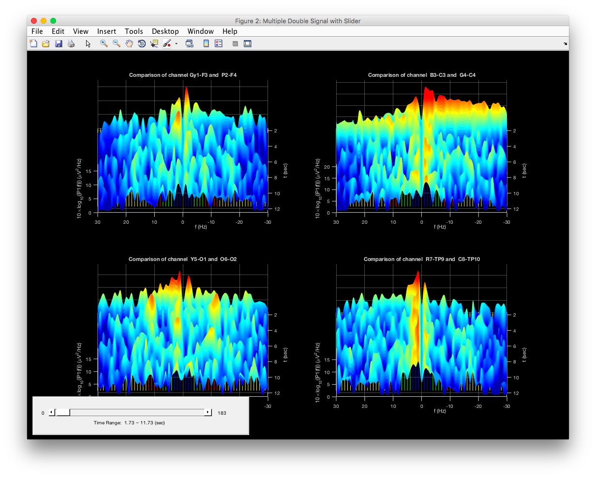
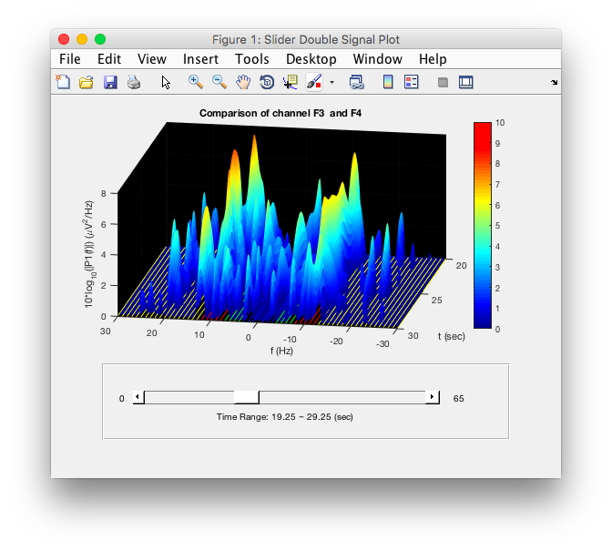
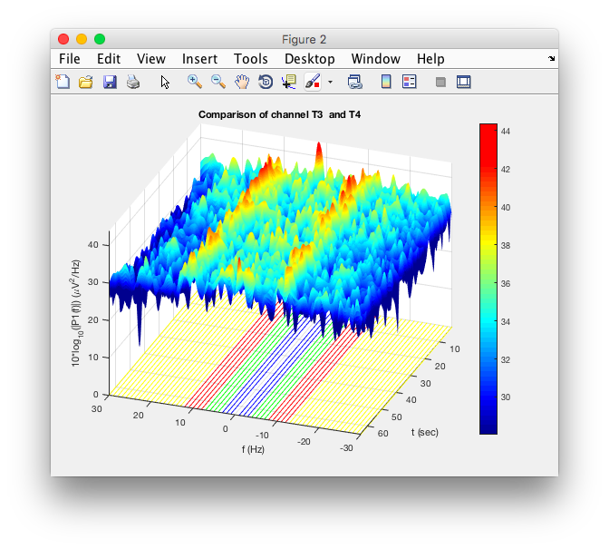

# EEGViewer

Electroencephalography signal analysis and visualization

## Demo



## Basic Usage

### Simple procedure

1. Input Data

    * Now support regular *.edf and OpenBCI format *.txt

    ```matlab
    viewer = EEGViewer('path/to/your/data.edf');
    ```

    or

    ```matlab
    viewer = EEGViewer();
    viewer.Load('path/to/your/data.edf')
    ```

2. Filtering (Optional)

    ```matlab
    viewer.FIRfiltering(1, 30); % Band-pass FIR filter of 1~30 Hz
    ```

3. Re-Reference (Optional)

    ```matlab
    viewer.AverageReReference();
    ```

4. SetMinDrop / SetMaxRange (Optional)

    ```matlab
    viewer.SetMinDrop(minimum) % Default is 0 (don't drop)
    ```
    ```matlab
    viewer.SetMaxRange(maximum) % Default is the maximum of all channel's FFT data
    ```

5. Static Plot

    ```matlab
    viewer.PlotSingleSignal(channel)                % Plot single signal spectrum
    viewer.PlotDoubleSignal(channel1, channel2)     % Plot two signal spectrum symmetrically
    ```

6. Animated Plot Setting (Optional)

    ```matlab
    viewer.SetAnimateMaxLength(minutes) % Show only the range of the time period on screen
    ```

7. Animated Plot

    ```matlab
    viewer.AnimatedDoubleSignal(channel1, channel2, speed) % Plot animated two signal symmetrically. (default speed is 2)
    viewer.AnimatedMultipleSignal(channelList, speed) % Plot all animated signal in channelList (must be even number, default speed is 2)
    ```

8. Slider Double Singal Plot

    ```matlab
    viewer.SliderDoublePlot(channel1, channel2, secLength) % Show only the range of time period on screen
    ```
    Ps. It share the animatemaxlength global variable and same setting of Animated Plot function in AddAuxiliaryInformation for now.

9. Slider Multiple Double Signal Plot

    ```matlab
    viewer.SliderMultiplePlot(channelList, secLength) % Show only the range of time period on screen
    ```

* Quick view of data

    ```matlab
    viewer.ScrollView()
    ```

* Add channel location name (for OpenBCI) (Optional)

    ```matlab
    viewer.SetChannelLocationName('ch1', 'ch2', 'ch3', 'ch4', 'ch5', 'ch6', 'ch7', 'ch8')
    ```

## Other function used

* readOpenBCItxt.m - load *.txt output from OpenBCI's machine
* read_edf.m - *.edf data loader

### from EEGLAB

* eegfilt.m - FIR Filter
* eegplot.m - Scroll view on raw data
* textsc.m - Places text in screen coordinates
* fastif.m - Fast if

## Popular Matlab Toolbox

### EEGLAB

* [EEGLAB](https://sccn.ucsd.edu/eeglab/index.php)
* [Wiki Tutorial](https://sccn.ucsd.edu/wiki/EEGLAB_TUTORIAL_OUTLINE)

### BCILAB

Open Source Matlab Toolbox for Brain-Computer Interface research

* [BCILAB](https://sccn.ucsd.edu/wiki/BCILAB)

### ERPLAB

* [ERPLAB](https://erpinfo.org/erplab/)

### FieldTrip

* [FieldTrip](http://www.fieldtriptoolbox.org/)

## Related Links

### OpenBCI

* [OpenBCI Documentation](http://docs.openbci.com/)
    * [Doc Github](https://github.com/openbci/docs)
    * [3rd Party Software - Matlab](http://docs.openbci.com/3rd%20Party%20Software/01-Matlab)

### Python EEG

* [Pbrain repository](https://github.com/nipy/pbrain)

## Previous Version Demo




